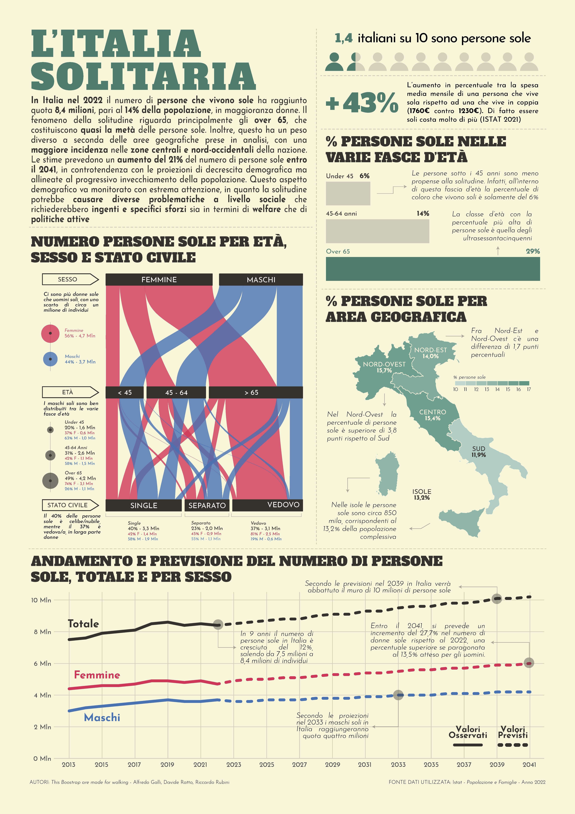

This infographic was crafted as a contribution to the *"Data (in) context - Thinking with Data"* competition. This competition was organized by *ISTAT*, *Società Statistica Italiana* (SIS), and the *University of Salerno*, with the sponsorship of *Banca Campania Centro*.

The poster focuses on the issue of loneliness in Italy, examining this phenomenon across different age groups, genders, and geographical regions. To create this infographic, original data from ISTAT was carefully processed to make it suitable for data visualization. The visual elements were generated using R and the *ggplot2* package, and later refined, enriched, and standardized in Illustrator.

This poster received the top prize in the *"Best Poster for Communicative Effectiveness"* category.

