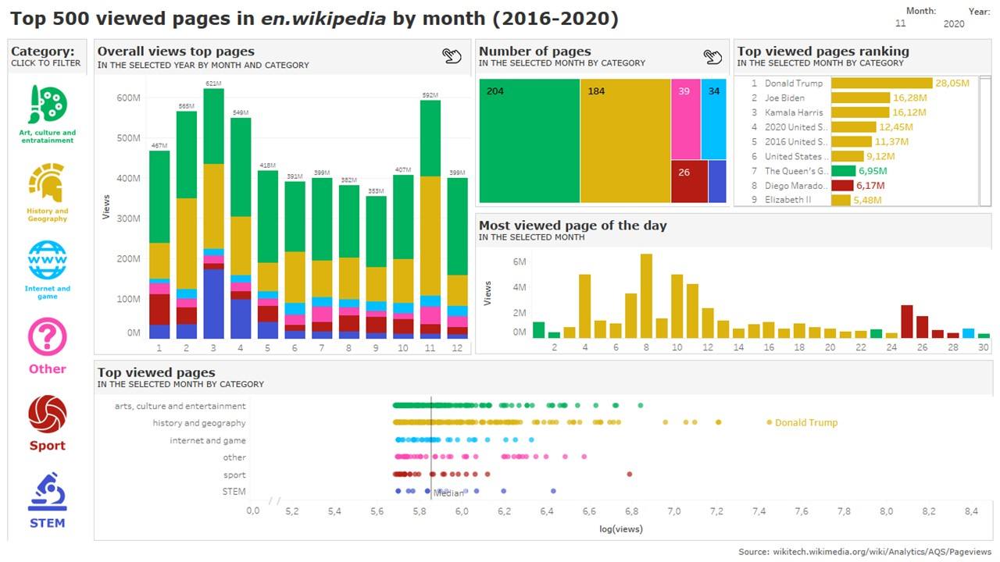
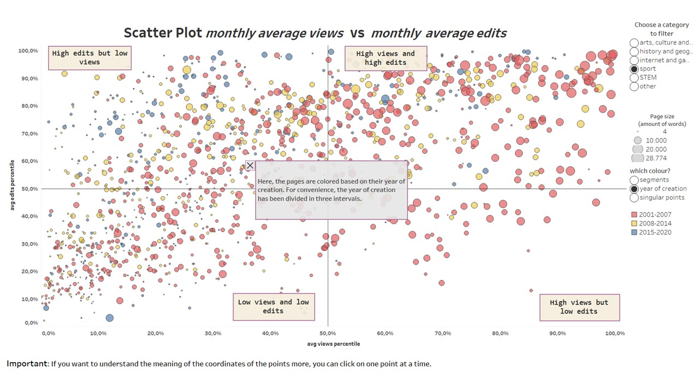

In this data management and data visualization project, our analysis involves three key components:

**Managing Data with MongoDB Document Database:** To efficiently handle and store data, we utilized MongoDB, a robust document database. This allowed us to organize and manage our dataset effectively, ensuring it is easily accessible and scalable.

**Categorization of Wikipedia Pages**: Our project involved the categorization of Wikipedia pages with a system that, among other things, uses a third parts algorithm. This system was designed to query a Knowledge Base (KB), specifically Wikidata, and leverage various online tools accessible via APIs. Through this process, we were able to categorize Wikipedia pages accurately and efficiently, enhancing data organization and accessibility.

**Construction of Interactive Infographics with Tableau:** To make the categorized data more accessible and insightful, we constructed interactive infographics using Tableau. These infographics provided users with a dynamic and visually engaging way to explore and interact with the categorized data.

**Evaluation Using Questionnaires and User Tests:** To ensure the effectiveness of our data visualization solution, we conducted rigorous evaluations. This included gathering feedback through questionnaires from users who interacted with our Tableau-based infographics. Additionally, we conducted user tests to assess the usability and user-friendliness of our visualization tools. This feedback helped us refine our design and ensure that the final product met the needs and expectations of our target audience.

The full report is published [HERE](https://riccardorubini98.github.io/wikitrend_site/)

